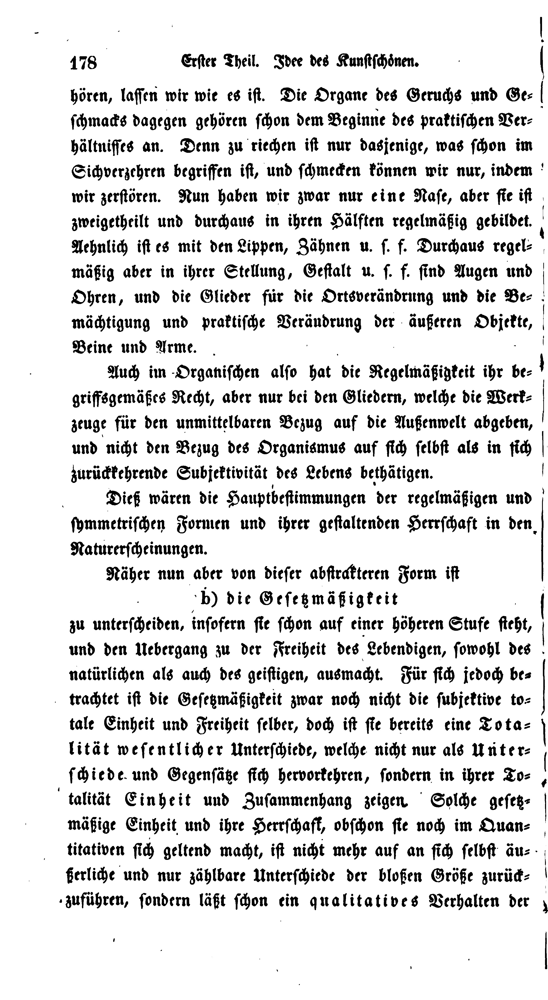

# googleb-ok

`googleb-ok` extracts text from a PDF and was written with
[Google Books](http://books.google.com) in mind. Google's optical
character recognition has become very good over the last years, even
for works printed in German *black letter*, aka *Gothic letter*
(Frakturschrift). But as long as there's is no good text extraction
tool that can deal with the slight variances in the glyph line up of
scanned books, this valuable resource remains unused by text mining
and NLP folks.

[`pdftotext`](https://www.xpdfreader.com/pdftotext-man.html) does a
valuable job in text extraction, but too often fails with lines or
paragraphs in the wrong
order. [`PDFMiner`](https://github.com/euske/pdfminer) performs much
better, but its output suffers from the inexact lineup of Glyphs in
scanned books. `googleb-ok` wants to overcome these problems. It's not
intended for the extraction of tabulars, but only of a single text
column. It wouldn't be too hard to extend it to extract two or more
columns, though.

`googleb-ok` is written in [Haskell](https://www.haskell.org/). It is
a library and a commandline tool. It was written as a generic tool
which can be plugged into an arbitrary PDF parsing library. To achieve
this, it's functionality is defined for
[type classes](https://www.schoolofhaskell.com/school/starting-with-haskell/introduction-to-haskell/5-type-classes)
(the most important is [`Glyph`](src/Pdf/Extract/Glyph.hs)), which can
then be instantiated by the data types of a parser. Right now it can
read PDFs using the
[`pdf-toolbox`](https://github.com/Yuras/pdf-toolbox) written in
Haskell, or the XML representation of a PDF document, which is yielded
by PDFMiner's `pdf2txt.py -t xml ...` command. The results of the
pipeline `pdfminer -t xml ... | googleb-ok -x` are very promising (see
[example](#example) below), while parsing PDFs directly with the
`pdf-toolbox` still suffers from several deficiencies.

`googleb-ok` is still under development.

## Installation

For building and installing [`stack`](https://docs.haskellstack.org),
the haskell build tool, is required.

1. Clone this repository
2. Clone [`pdf-toolbox`](https://github.com/Yuras/pdf-toolbox) so
   that it lives in the same directory as `googleb-ok`.
3. `cd` into the `googleb-ok` directory and run

		stack setup
		stack build
		stack install # optional

The build command will take a while. The first 2 commands will not
install anything outside the `googleb-ok` folder. If you want to test
the app before the installation, then leave out the last step and try
the commandline tool from the `googleb-ok` directory using

	stack exec -- googleb-ok --help

This will show you the options and arguments which you can chose to
optimize the extraction result. E.g. `1.3` has shown to be a good
choice for the fixed spacing factor. See below for an example.

## Usage

`googleb-ok` is a command line program. You definitively have to run

	googleb-ok --help

and read about the command line options. [Here](docs/usage) is the
output of the help command.

## Features / How it works / Heuristics

### Inter-word spacing

The PDF-Format does not even know the concept of spaces!  Adding
inter-word spaces turned out to work good based on a fixed factor: If
the distance to the next glyph exceeds the product of the width and a
fixed spacing factor, then insert a space. The factor may be changed
with a command line argument.

### Collect the glyphs of a Line

The glyphs of a line are collected by sliding window
clustering. Collections of glyphs in text spans found by the pdf
parser are ignored; the clustering is done over the pure bag of glyphs
of a page.

Different from k-means clustering, the sliding window algorithm finds
the number of clusters on its own, provided a suitable window size and
stepping width. These may be set using a command line parameter. For
pages with more than 42 lines it should be adjusted.

The clustering is done on a univariate distribution: the y-coordinates
(heights) of the glyphs' bottoms. The downside of this is that the
lines must not be too skew.

### Categorization of lines

The categorization of lines can be switched on and off. By default,
categorization is switched on. But since it is based on several
clusterings performed for each page (left border, right border, glyph
sizes) it slows down the app. Using the `-C` command line option for
no categorization at all speeds things up.

Right now the categorization is done on the basis of
indentation. Categorization based on line skip will be added in future.

If switched on, the following types of lines are identified on the
base of the following heuristics:

#### Page Header/Footer

- first/last line of a page
- an arabic number is present
- or a roman number is present (TODO)
- line filling << maximal line filling (TODO)
- based on command line options header/footer may be dropped, kept or
  only the number kept

#### Sheet signature (dt. Bogensignatur)

- last line of a page
- indented (adjustable by command line parameters)
- lower font size (TODO)
- line filling << maximal line filling
- number present (TODO)

#### Custos (dt. [Kustode](https://de.wikipedia.org/wiki/Kustode_(Buchherstellung)))

- last line of a page
- indented to some bigger portion of the page width (adjustable by
  command line parameters)

#### Block quote

(still experimental and turned of by default)

- indented
- lower font size
- spans several lines with same indent (TODO)

#### New paragraph

- indented

#### Default line (subsequent lines of a paragraph)

- the rest

### Dropping glyphs outside of the type area

- type area (width) is determined by clustering for the start and end
  of the most lines.
- command line toggle for dropping
- single glyphs above the top or be lower than the bottom line of the
  type area are dropped by the line clustering algorithm:
- a threshold may be defined for the line clustering algorithm. If the
  count of glyphs in a specific height of the page falls below the
  threshold, the glyphs are dropped (customizable by command line
  arguments)
- single inter-line glyphs are dropped by the same line clustering
  algorithm

### Syllable division

- search for an unknown part of bigram around a line break
- the first part of the bigram must end with a hyphenation mark,
  e.g. `-`. Most interestingly google books as no hyphenation mark (at
  least for Gothic script). (TODO: at the moment, no hyphenation mark
  is tested)
- if one of them is not known in a reference vocabulary, try to join
  them
- join them, if the joint token is present in the vocabulary

This heuristics may lead to false positives if the reference
vocabulary is too small. Have Zipf's law in mind: A multitude of
tokens occur only once in your document!

Use the `--tokens` option to generate a list of tokens from the
document without the bigrams around line breaks.

Use the `-w` option to use that list or an other vocabulary as pool of
known tokens. Be warned: A word pool generated from only one document
is to small, because of Zipf's law.

## License

Licensed under either of:

- [BSD-3-Clause license](https://opensource.org/licenses/BSD-3-Clause)
- [Apache License, version 2.0](https://opensource.org/licenses/Apache-2.0)

As a user, you may use this code under either license, at your option.

## Example

A page from Georg Friedrich Wilhelm Hegel's *Vorlesungen über die
Ästhetic*, edited by Hotho in 1835,
[scanned by Google](https://books.google.de/books?id=Fss9AQAAMAAJ&hl=de):

We use PDFMiner to generate an xml representation of the document's
glyphs first. Then we create a word pool without the document header
and books table of contents which isn't linearized in an acceptable
way. Then we linearize page 205 of the PDF, which is page 178 of the
book. We use the word pool as a vocabulary for repairing the syllable
division at the line breaks. The `-M` switch drops glyphs outside of
the type area. `2> Heg1835a.log` redirects the logging information
printed to
[`stderr`](https://en.wikipedia.org/wiki/Standard_streams#Standard_error_(stderr))
into a log file.

	pdf2txt.py -t xml Heg1835a.pdf > Heg1835a.xml
	googleb-ok -x -r 30-574 --tokens Heg1835.xml > wordpool.txt
	googleb-ok -x -r 205 -M -w wordpool.txt Heg1835a.xml 2> Heg1835a.log

Here is the output:

	[[178]] hören, laſſen wir wie es iſt. Die Organe des Geruchs und Geſchmacks
	dagegen gehören ſchon dem Beginne des praktiſchen Verhältniſſes
	an. Denn zu riechen iſt nur dasjenige, was ſchon im
	Sichverzehren begriffen iſt, und ſchmecken können wir nur, indem
	wir zerſtören. Nun haben wir zwar nur eine Naſe, aber ſie iſt
	zweigetheilt und durchaus in ihren Hälften regelmäßig gebildet.
	Aehnlich iſt es mit den Lippen, Zähnen u. ſ. f. Durchaus regelmäßig
	aber in ihrer Stellung, Geſtalt u. ſ. f. ſind Augen und
	Ohren, und die Glieder für die Ortsverändrung und die Be
	mächtigung und praktiſche Verändrung der äußeren Objekte,
	Beine und Arme.

        Auch im Organiſchen alſo hat die Regelmäßigkeit ihr be
	griffsgemäßes Recht, aber nur bei den Gliedern, welche die Werk
	zeuge für den unmittelbaren Bezug auf die Außenwelt abgeben,
	und nicht den Bezug des Organismus auf ſich ſelbſt als in ſich
	zurückkehrende Subjektivität des Lebens bethätigen.

        Dieß wären die Hauptbeſtimmungen der regelmäßigen und
	ſymmetriſchen Formen und ihrer geſtaltenden Herrſchaft in den
	Naturerſcheinungen.

        Näher nun aber von dieſer abſtrakteren Form iſt

        b) die Geſetzmäßigkeit  
	zu unterſcheiden, inſofern ſie ſchon auf einer höheren Stufe ſteht,
	und den Uebergang zu der Freiheit des Lebendigen, ſowohl des
	natürlichen als auch des geiſtigen, ausmacht. Für ſich jedoch betrachtet
	iſt die Geſetzmäßigkeit zwar noch nicht die ſubjektive totale
	Einheit und Freiheit ſelber, doch iſt ſie bereits eine Totalität
	weſentlicher Unterſchiede, welche nicht nur als Unterſchiede
	und Gegenſätze ſich hervorkehren, ſondern in ihrer Totalität
	Einheit und Zuſammenhang zeigen. Solche geſetzmäßige
	Einheit und ihre Herrſchaft, obſchon ſie noch im Quan
	titativen ſich geltend macht, iſt nicht mehr auf an ſich ſelbſt äußerliche
	und nur zählbare Unterſchiede der bloßen Größe zurück
	zuführen, ſondern läßt ſchon ein qualitatives Verhalten der

As you can see, some lines have gotten longer--because the syllable
division has been repaired. The log file reports this:

	Joining "Ge" and "ſchmacks".
	Joining "Ver" and "hältniſſes".
	Unable to repair: "im" and "Sichverzehren".
	Unable to repair: "iſt" and "zweigetheilt".
	Joining "regel" and "mäßig".
	Unable to repair: "und" and "Ohren,".
	Unable to repair: "Be" and "mächtigung".
	Unable to repair: "be" and "griffsgemäßes".
	Unable to repair: "Werk" and "zeuge".
	Unable to repair: "ſich" and "zurückkehrende".
	Unable to repair: "den" and "Naturerſcheinungen.
	".
	Unable to repair: "iſt" and "b)".
	Joining "be" and "trachtet".
	Joining "to" and "tale".
	Joining "Tota" and "lität".
	Joining "Unter" and "ſchiede".
	Joining "To" and "talität".
	Joining "geſetz" and "mäßige".
	Unable to repair: "Quan" and "titativen".
	Joining "äu" and "ßerliche".
	Unable to repair: "zurück" and "zuführen,".

`Quantitativen` and `Bemächtigung` were not in the word pool, so the
bigrams weren't joined together.

If you use the `-C` option, you will get a pure linearization, without
line categorization. Comparing the outputs you can see that an capital
`Y`, which was fail-OCRed in the book binding, was dropped by the `-M`
option.

That's the output of `googleb-ok -x -C -r 205 Heg1835a.xml`:

	178 Erſter Theil. Idee des Kunſtſchönen.
	hören, laſſen wir wie es iſt. Die Organe des Geruchs und Ge
	ſchmacks dagegen gehören ſchon dem Beginne des praktiſchen Ver
	hältniſſes an. Denn zu riechen iſt nur dasjenige, was ſchon im
	Sichverzehren begriffen iſt, und ſchmecken können wir nur, indem
	wir zerſtören. Nun haben wir zwar nur eine Naſe, aber ſie iſt
	zweigetheilt und durchaus in ihren Hälften regelmäßig gebildet.
	Aehnlich iſt es mit den Lippen, Zähnen u. ſ. f. Durchaus regel
	mäßig aber in ihrer Stellung, Geſtalt u. ſ. f. ſind Augen und
	Ohren, und die Glieder für die Ortsverändrung und die Be
	mächtigung und praktiſche Verändrung der äußeren Objekte,
	Beine und Arme.
	Auch im Organiſchen alſo hat die Regelmäßigkeit ihr be
	griffsgemäßes Recht, aber nur bei den Gliedern, welche die Werk
	zeuge für den unmittelbaren Bezug auf die Außenwelt abgeben,
	und nicht den Bezug des Organismus auf ſich ſelbſt als in ſich
	zurückkehrende Subjektivität des Lebens bethätigen.
	Dieß wären die Hauptbeſtimmungen der regelmäßigen und
	ſymmetriſchen Formen und ihrer geſtaltenden Herrſchaft in den
	Naturerſcheinungen.
	Näher nun aber von dieſer abſtrakteren Form iſt
	b) die Geſetzmäßigkeit
	zu unterſcheiden, inſofern ſie ſchon auf einer höheren Stufe ſteht,
	und den Uebergang zu der Freiheit des Lebendigen, ſowohl des
	natürlichen als auch des geiſtigen, ausmacht. Für ſich jedoch be
	trachtet iſt die Geſetzmäßigkeit zwar noch nicht die ſubjektive to
	tale Einheit und Freiheit ſelber, doch iſt ſie bereits eine Tota
	lität weſentlicher Unterſchiede, welche nicht nur als Unter
	ſchiede und Gegenſätze ſich hervorkehren, ſondern in ihrer To
	talität Einheit und Zuſammenhang zeigen. Solche geſetz
	mäßige Einheit und ihre Herrſchaft, obſchon ſie noch im Quan
	titativen ſich geltend macht, iſt nicht mehr auf an ſich ſelbſt äu
	ßerliche und nur zählbare Unterſchiede der bloßen Größe zurück
	zuführen, ſondern läßt ſchon ein qualitatives Verhalten der Y

